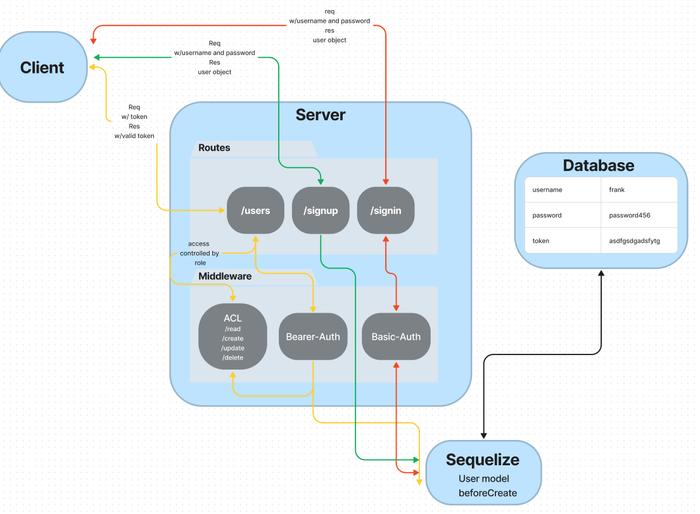

# auth-api

401d53 Lab 8 Auth API Server

## Project: Bearer-Auth

Author: Justin Mathieu

## Problem Domain

Combining auth and api server.

## Links and Resources

[GitHub Actions](https://github.com/Justin-Mathieu/auth-api/actions)  
[back-end prod url](https://auth-api-ppjs.onrender.com)  

## Collaborators

401d53 and 401d10 Used demo code as permitted.

## Setup

- Port variable
- Connection string for database.
- Secret for JWT.

## How to initialize/run your application (where applicable)

- Clone repo
- Run npm i in terminal
- Run nodemon in terminal

## Routes

POST: /signin - Authenicates user with password.(Basic auth)  
POST: /signup - Creates user in database.  
GET: /users - If valid JWT token gets all users.(Bearer auth)  
GET: /secret - Validates jwt to access secret area.(Bearer auth)  

## Tests

Run the command npm test with dependencies installed.

## UML

## TODO

- Testing...
- Deploy.
